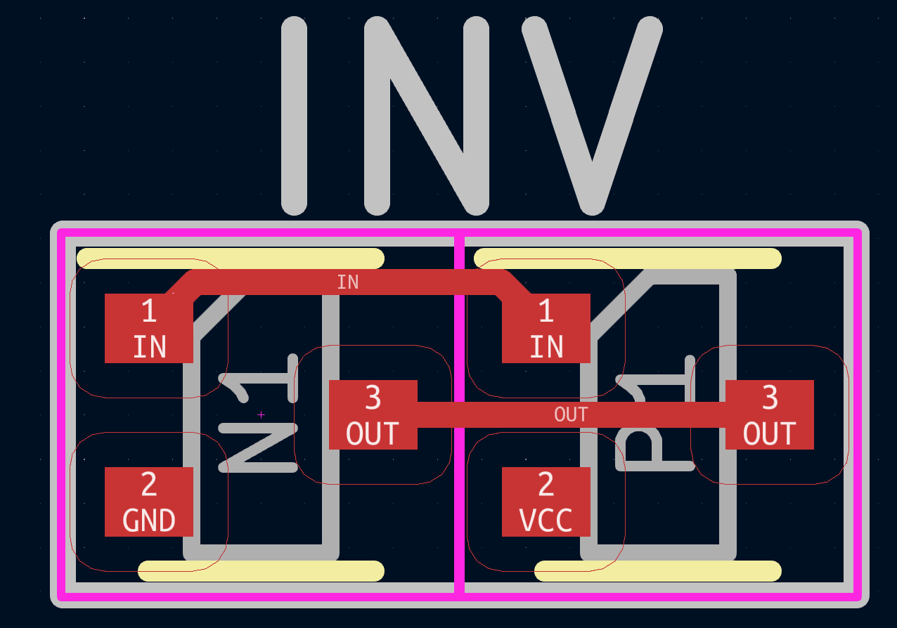
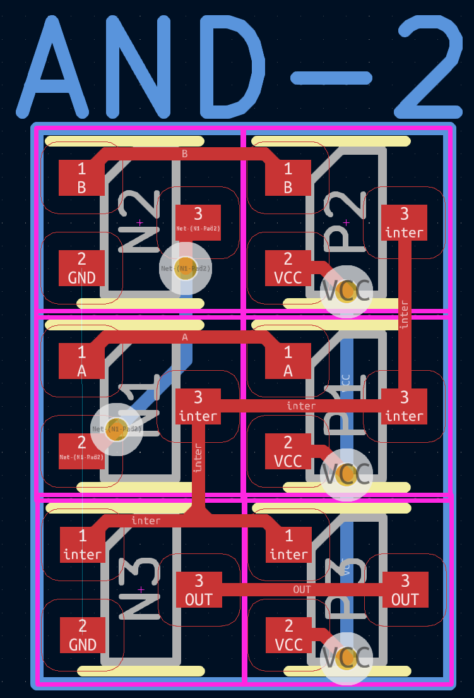
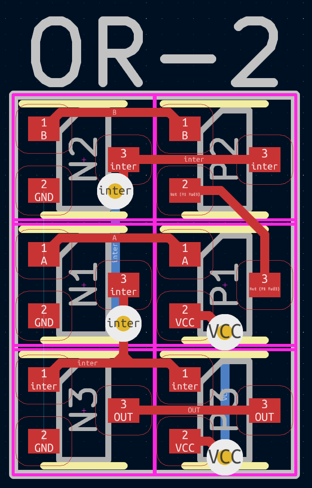
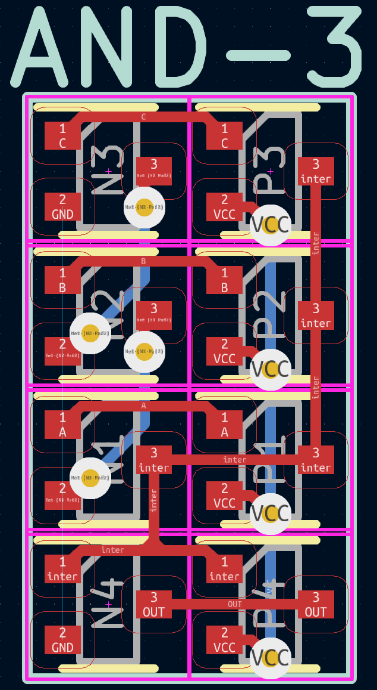
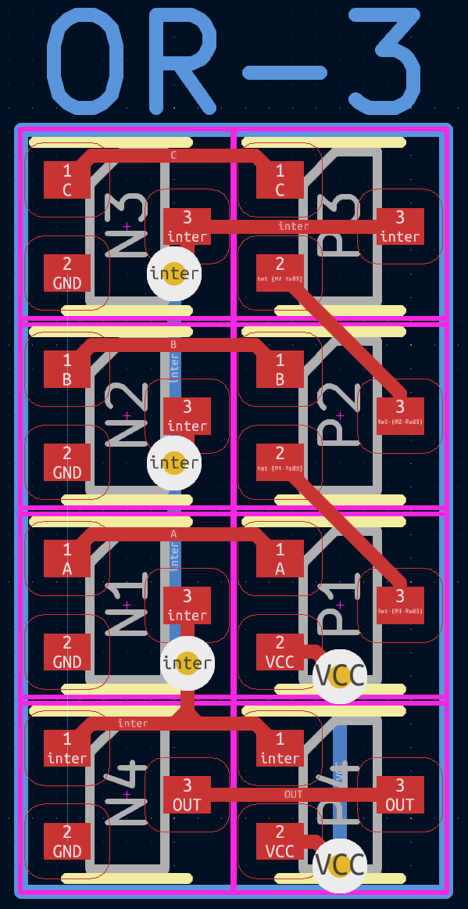
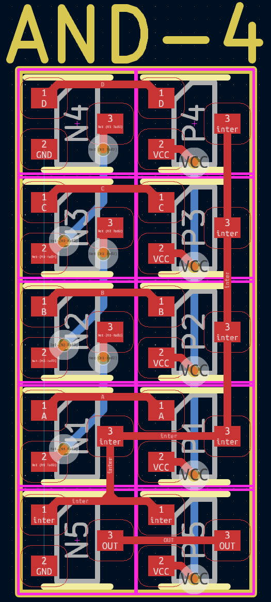

# Discrete Transistor Logic Gates
This repo is associated with our [custom ASIC video](https://youtu.be/a64thiPXEqw?si=YsXqarDaaLw36tvk).  
It contains my designs for 2 input, 3 input, and 4 input And/Or gates, and an inverter.
These are CMOS logic gates built using SOT-523 MOSFETs.
These designs can technically be infinitely scaled to any number of inputs. You're better off going towards VLSI and creating dedicated Pull-Up networks and Pull-Down Networks (PUN/PDN)s though. That'll dramatically slash transistor count and thus board space.

Let us know if you do anything using this. It's a pain to work with, but it can be made to work. You have to use the modern kicad `append board` feature to place each logic gate where it goes on the board, then manually set each mesh. That's the best way I could come up with to do this.

There are schematics associated with each of these gates in their respecitve folders. They're full kicad projects. That should provide enough context for what the circuit does. For immediate reference, the footprints are provided below.

## The full board

### It's associated logic experssions.

## The Inverter

## 2 Input And Gate

## 2 Input Or Gate

## 3 Input And Gate

## 3 Input Or Gate

## 4 Input And Gate

## 4 Input Or Gate
Not Implemented.  
Never will be.  
Follow the pattern.